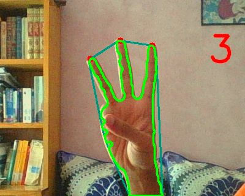
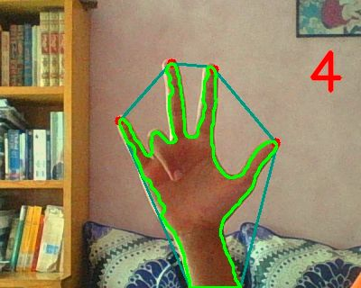
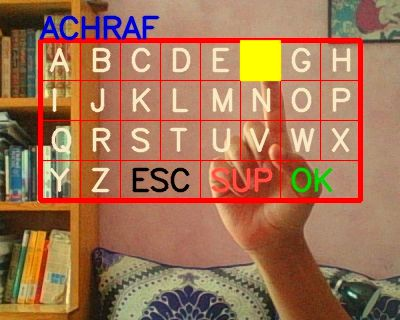
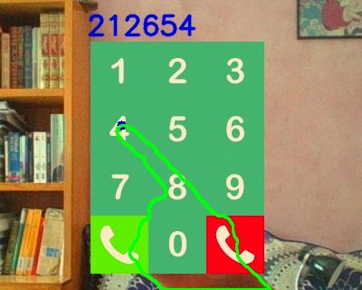
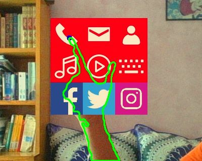

# HandsOn
The human-machine interface is the bridge between the human user and the machine. Our aim is to find a way to embed digital information into the real world scene, and to communicate and interact with a machine in a novel way without using traditional Peripherals. 
Through our work, we try to endow computers with a high-level understanding from digital images or  videos , and make them able to acquire informations and requests from the simple mouvement of the hand. In this direction, we will optimize workstation layout, along with providing a easy and efficient communication with machines.

This project is a human-computer interface that can understand some basic commands given by the user by analyzing with hand gestures with a camera.
Image processing techniques are used to extract the hand from the background, then to try and extract useful information from it by tracking the tip of the fingers. The extracted information could be the number of the raised fingers or the coordinates of a pointing finger.


## Features

There is the features that were developed in this project:

* **Extracting Numbers**: this feature uses image processing to count the number of fingers raised by the user. Therefore, the user have 6 values (from 0 to 5) that he can send to the computer.





* **Typing Letters**: this feature tracks a pointing finger and uses a drawn keyboard to extract the letters written by the user.



* **Typing Numbers**: this feature tracks a pointing finger and uses a dialing menu to extract the numbers written by the user.



* **Navigating in a menu**: this feature tracks a pointing finger and uses a menu to send the user to different parts of an application



## Commands

To launch one of the four features described above:

* **Extracting Numbers** : ``` extractNumbers/extractNumbers.py ```
* **Typing Letters** : ``` Keyboard/extractLetters.py ```
* **Typing Numbers** : ``` PhoneNumbers/PhoneNumbers.py ```
* **Navigating in a menu**: ```Menu/menu.py ```

The scripts use the computer webcam. When you launch a script, orientate the camera towards a stationary background, then press ``` b ```. The script will capture the background and use it to extract the user's hand afterwards.

You can now your hand to send commands to the computer.
